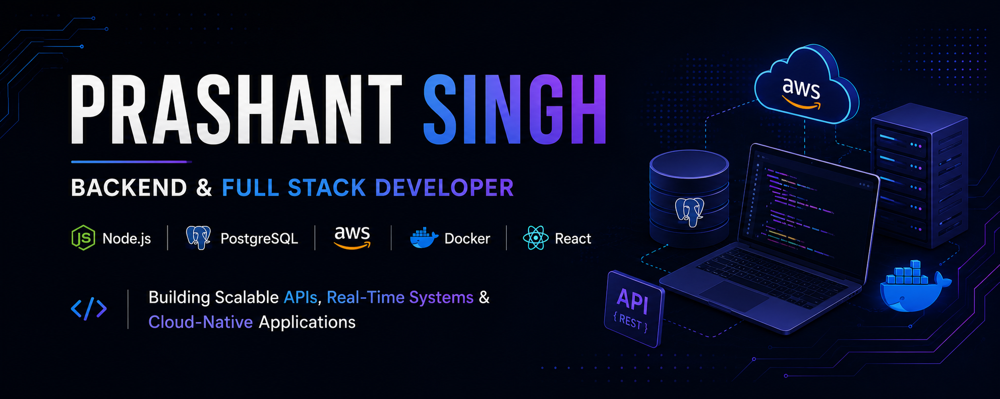

  

 
# Hi there, I'm Prashant Singh 👋

### Backend & Full Stack Developer | Node.js | React | PostgreSQL | AWS | Docker

Computer Science graduate passionate about building scalable web applications, secure REST APIs, real-time systems, and cloud-native solutions. I enjoy solving complex problems, designing backend architectures, and deploying production-ready applications.

---

## 🚀 About Me

* 🎓 B.Tech in Computer Science & Engineering (2021–2025)
* 💻 Backend-focused Full Stack Developer
* ☁️ Experienced with AWS, Docker, CI/CD, and cloud deployments
* 🔐 Interested in API development, authentication systems, and scalable backend architectures
* 🧠 Solved 300+ Data Structures & Algorithms problems

---

## 🛠️ Tech Stack

### Languages

### Frontend

### Backend

### Databases

### Cloud & DevOps

### Tools

---

## 🌟 Featured Projects

### 📝 ThinkInk

AI-powered blogging platform built using the MERN stack with cloud deployment and AI-assisted content generation.

#### Features

* JWT Authentication & Protected Routes
* AI Content Generation using Google Gemini
* Comments & Likes System
* Dockerized Deployment
* AWS EC2 Hosting
* GitHub Actions CI/CD Pipeline

🔗 Repository: https://github.com/prashantsingh1122/ThinkInk

🌐 Live Demo: https://think-ink-jet.vercel.app/

---

### 🎓 EduCast

Real-time educational content broadcasting platform designed for content sharing, live updates, and interactive engagement.

#### Features

* Real-Time Content Broadcasting
* Live Polling System
* Role-Based Access Control
* PostgreSQL Database
* Redis Integration
* Socket.IO Real-Time Communication
* Dockerized Infrastructure
* AWS Deployment & CI/CD

🔗 Repository: https://github.com/prashantsingh1122/Real-Time-Polling-and-content-broadcasting-system

🌐 Live Demo: https://content-broadcasting-system-three.vercel.app/

---

## 🏆 Achievements

* Solved 300+ DSA problems across multiple coding platforms
* Gold Medalist in Table Tennis (Zonal Level)

---

## 💡 Coding Profiles

### LeetCode

https://leetcode.com/u/Prashant__Singh/

### HackerRank

https://www.hackerrank.com/profile/prashantsingh351

---

## 📫 Connect With Me

📧 Email: [prashantsingh3517@gmail.com](mailto:prashantsingh3517@gmail.com)

💼 LinkedIn: linkedin.com/in/prashantsingh1122

🐙 GitHub: github.com/prashantsingh1122
